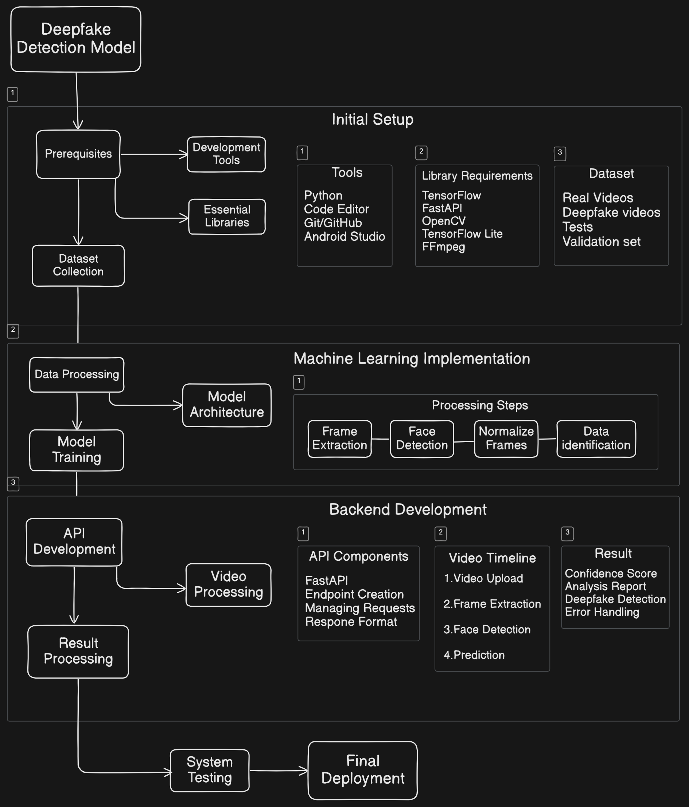

# Deepfake-Detection-Solution

This project aims in identifying Deepfake videos from mobile devices in applications like WhatsApp, skype in real time. This will be done by a deep learning model with help of API and datsets to train the model and improve its accuracy. 
The project will include various technologies like TensorFlow, OpenCV, FFmpeg for frame extraction, Wav2Lip and much more. 

Finally we will deploy the model on mobile devices using TensorFlow Lite and check for the confidence score(0-100) and detection report that is if the video clip is deepfake or not.
# Solution Path

